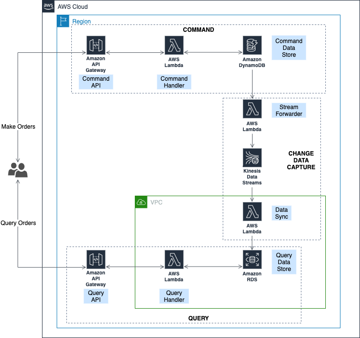

# Introduction

(See https://aws-cqrs-lab.s3.amazonaws.com/index.html for Hugo site verison.)

This is a air ticketing booking demo app for CQRS(Command Query Responsibility Seggregation) pattern , the goal of this sample app is to demonstrate CQRS architecture concept and its reference architecture, design and implementation based on AWS services, which include:

- IAM
- API Gateway
- Lambda
- DynamoDB
- RDS MySQL
- Kinesis Stream
- CDK (Cloud Development Kit) 

# Requirments - User Stories

### Customer (Passenger) Perspective Stories, (Command Part)

- As a customer, I could put an order with below information for reserving flight.
  - customer id, flight id, date time
- As a customer, I could update my flight order
- As a customer, I could cancel my flight order
- As a customer, I could list all my orders and check out details

### **Admin Perspective Stories (Query Part)**

- As a admin, I could query customer flight booking information so that I could dispatch notification to them when I cancel or update flight information
- As a admin, I could query customers with flights start/transfer/stop contains city with extreme whether  so that I could send out reminder msg.

# Architecture

## Components

As illustrated in above architecture diagram, this demo app mainly consists of below parts:

- Command Service, which handles various of ticket booking related command http request and persist command information into DDB. This is the implementation for the customer user story part.
- Change Data Capture Service, which captures the data change from DDB table, then do necessary data transformation, and finally flush the data delta into RDS MySQL DB tables
- Query Service, which provides various of query API for serving the air ticket admin user stories
- Data Ingestor, this is a Python script which encapsulates above Command/Query APIs, and provides a series of operation numbers for simulating user story APIs as well as some system maintainence/query APIs

# Setup Step on AWS Cloud9

## **Config Cloud9 Env**

- Create an cloud9 env based on OS **Aamazon Linux 2** 
- Disable Cloud9 temp credentials by: Cloud9 ide > aws settings > credentials > aws managed temp credentials > disable it
- Remove the line with "token" in file ~/.aws/credentials to force aws CLI use AK/SK instead of the empty token
- Run `aws configure` to config your AWS CLI env with administrative user AK/SK and default region, recommend using 'us-east-1' for latest lambda feature and all the AWS services/resource required
- Run `aws sts get-caller-identity` or  `aws s3 ls` to check out your s3 buckets for verifying the CLI config works
- Update pip to pip3. On amazon linux 2, python 2.7 is the default python version, pip version is 9, run:

  - `wget https://bootstrap.pypa.io/get-pip.py`
  - `sudo python3 get-pip.py`
  - Run `pip -V, python -V` to check out python and pip version, make sure on python3.6/pip3 19

## Use AWS CDK to deploy CQRS CloudFormation stack

- Clone source code by `git clone https://github.com/aws-samples/cqrs-lab-on-aws`, run:

  - `cd cqrs/src/`
  - `sudo /usr/local/bin/pip3 install -r requirements.txt`
  - `npm install -g aws-cdk`
  - `lambda/install_pymysql.sh`
  - `cdk bootstrap`

- Verify cloudformation stack "[CDKToolkit](https://console.aws.amazon.com/cloudformation/home?region=us-east-1#/stacks/stackinfo?filteringText=&filteringStatus=active&viewNested=true&hideStacks=false&stackId=arn%3Aaws%3Acloudformation%3Aus-east-1%3A124456859051%3Astack%2FCDKToolkit%2Fe3a87f40-e010-11e9-95bf-120fc18a2440)" is created for managing CDK meta data

- Log on AWS management console, choose region: us-east-1，select service: system manager parameter store, create secure string with parameter name: AirTicket.AdminPass, Value: password, leave the KMS key source and id as default

- Deploy the CQRS Stack: `cdk deploy`

- Copy CDK's output Command/Query Endpoints for later demo usage similar to below:

  - `cqrs.QueryEndpointAA2CC78C = https://x3u4gw1wuc.execute-api.us-east-1.amazonaws.com/prod/`
  - `cqrs.CommandEndPointEndpoint4425EE8A = https://mmd28yuzfi.execute-api.us-east-1.amazonaws.com/prod/`

- Run `python3 src/ingestor.py`, **input '1' to initialize RDS MySQL DB**, then follow below steps

  

## Demo Steps

1. Customer Initialization  

   1. Input 6，which will insert 20 customers into DDB, verify the records in DDB CQRS table
   2. Then input 3, which will invoke the lambda and it will read customer info from RDS MySQL users table, it will show `Total customer number is 20`

2. Air Ticket Order Workflow

   1. Input 7，it will show many orders placed, verify the orders are updated into DDB CQRS table customers records
   2. Input 4, then MU5159, the script return `Customer number is 8` , which verifies there are 8 customers who have order flight MU5159
   3. Input 8, the script will randomly cancel some orders, then input 4 and MU5159, then it returns `Customer number is 4`, which verify some orders were successfully cancelled

3. Error Handling Workflow

   1. Check out the msg in Queue: cqrs-DeadLetterQueuexxx
   2. Input 11, which will input some malformed data which leads to error, verify that the dead letter msg queu number increased by 1

4. Duplication Msg Handling

   1. Input 2 via ingestor script, this will empty the DDB CQRS table and clear the RDS MySQL table records, input 3 to verify that 0 is returned, which means all table are empty now

   2. Input 10, then input 3, it returns `Total customer number is 1`, which means only 1 customer now

#Clean Up

- Run `cdk destroy` or manually delete the `cqrs` CloudFormation stack in management console
